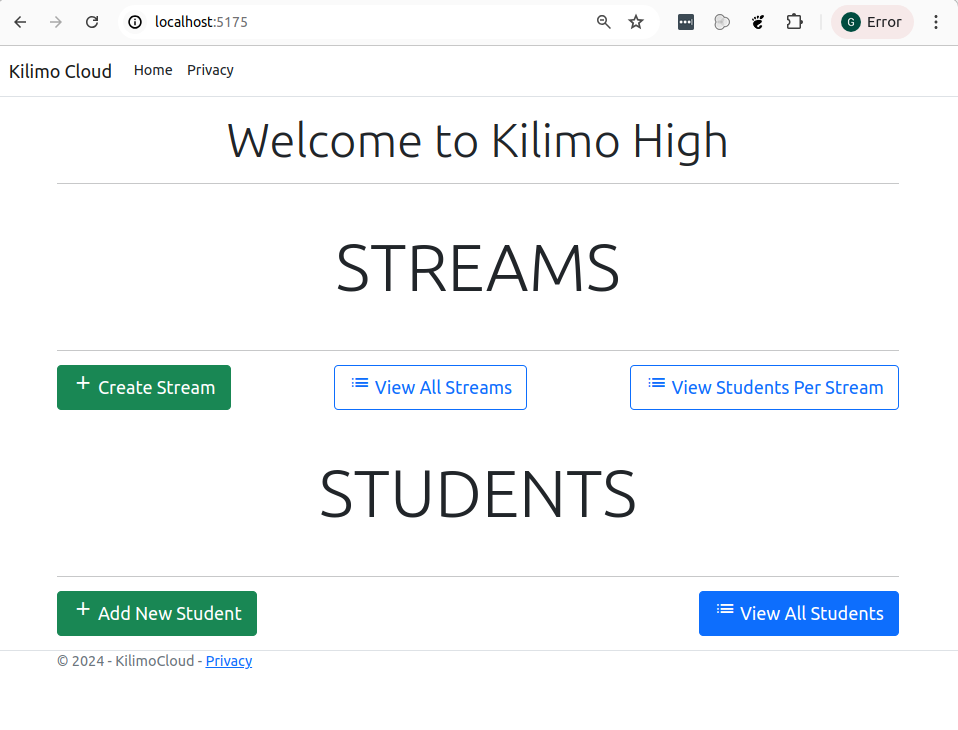
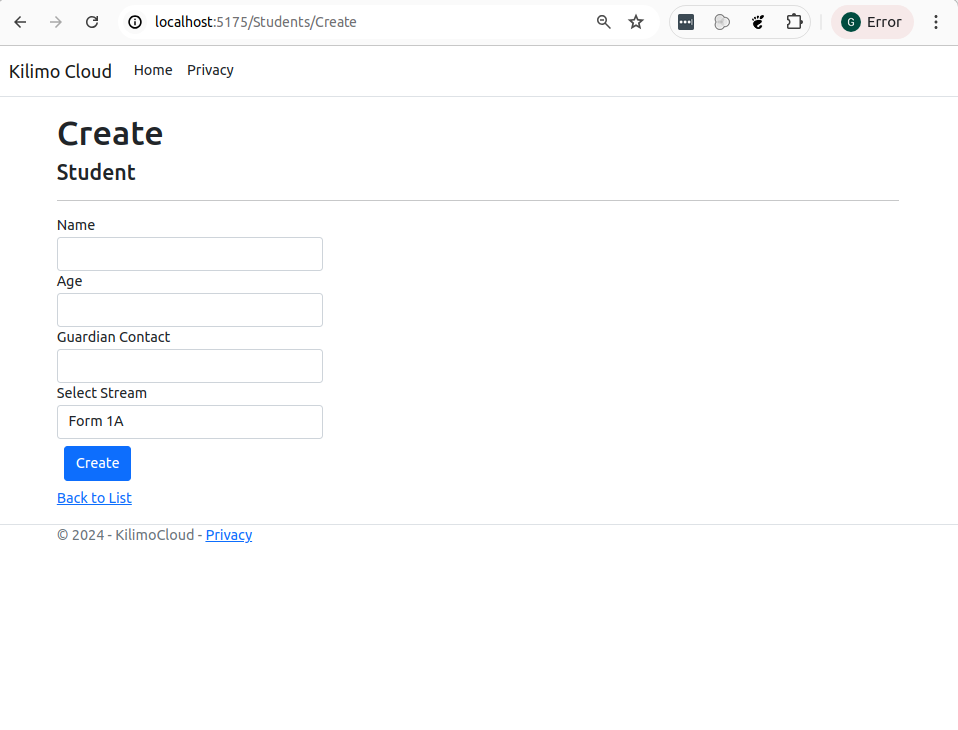
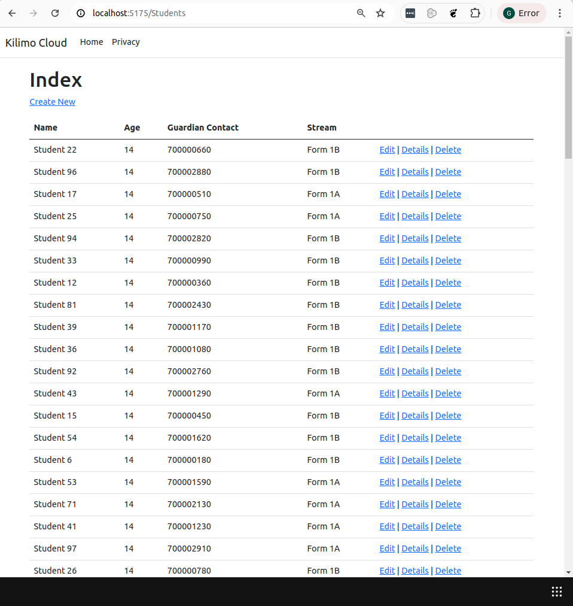
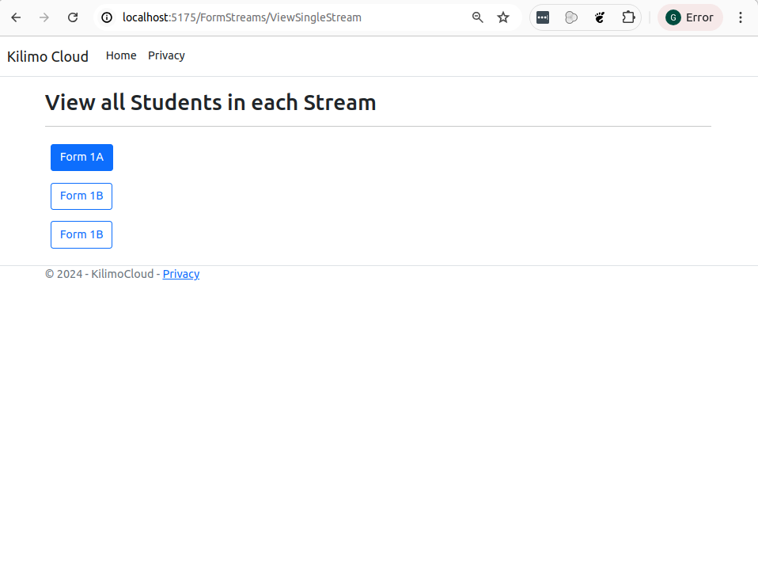

# KILIMO HIGH - GEORGE WANJOHI


## Application Particulars

1. The application is built on the latest version of [ASP.NET core 8](https://dotnet.microsoft.com/en-us/download/dotnet/8.0)
2. I am using Microsoft SQL Server
3. I am using the Code First Approach in creating the database

NOTE: There are no migrations to run. When you spin up the application the first time, it created the database and populates the tables with some seed data.

The Model/Entity Classes are as follows

To represent a Stream
```c#
public class FormStream
{
    public Guid FormStreamId { get; set; }
    public string Name { get; set; }
}
```


To represent a Student
```c#
public class Student
{
    public Guid Id { get; set; }
    [MaxLength(200)] [Required] public string Name { get; set; }
    [Required] public int Age { get; set; }

    [Display(Name = "Guardian Contact")]
    [MaxLength(200)]
    [Required]
    public string GuardianContact { get; set; }
    public virtual FormStream? FormStream { get; set; }
    [Required()] public Guid FormStreamId { get; set; }
}
```


## How to Run the Application

Open appsettings.json, change the value of _KilimoDBConnection_ connection string with an appropriate connection string that points to your MSSQL Server database instance.

Note that the name of the database supplied therein must not be EXISTING already. When you first run the application, a database  with the supplied name will be created.


```json
{
  "Logging": {
    "LogLevel": {
      "Default": "Information",
      "Microsoft.AspNetCore": "Warning"
    }
  },
  "AllowedHosts": "*",
  "ConnectionStrings": {
    "KilimoDBConnection": "Data Source=localhost;Initial Catalog=KilimoniCloud4;Persist Security Info=True;User ID=sa;Password=303mP$203;MultipleActiveResultSets=True;TrustServerCertificate=True"
  }
}

```

To Spin up the application, Navigate to **KilimoniCloud** folder, run the following command

```bash
> dotnet run
```


The Generated database will look as follows


```sql
create database KilimoCloud
go

use KilimoCloud
go

create table dbo.FormStreams
(
    FormStreamId uniqueidentifier not null
        constraint PK_FormStreams
            primary key,
    Name         nvarchar(max)    not null
)
go


use KilimoniCloud
go

create table dbo.Students
(
    Id              uniqueidentifier not null
        constraint PK_Students
            primary key,
    Name            nvarchar(200)    not null,
    Age             int              not null,
    GuardianContact nvarchar(200)    not null,
    FormStreamId    uniqueidentifier not null
        constraint FK_Students_FormStreams_FormStreamId
            references dbo.FormStreams
            on delete cascade
)
go

create index IX_Students_FormStreamId
    on dbo.Students (FormStreamId)
go


```

## Home Page

The homepage is as follows



To Create/ Capture Streams, click **Create Stream** Link

To View all Class Streams, Click **View All Streams**

To View A single stream, Cick **View All Streams** then on the page that follows, click **Details** link to see stream particulars

To Capture students data, click **Add New Student** You will be directed to the following page





## Student related actions such as Edit, Delete and Viewing a single Students Data can be obtained from going to **View all Students** list and interacting with the actions that are attached to each student row item 





## To view students that belong to a particular stream

Click **View Students per Stream** link on the main page, You will be navigated to the following page



From here, click on a stream to a list of students that belong to that particulr stream.


## CLosing Remarks


Thank you for the opportunity to interview with Fintech Group.  